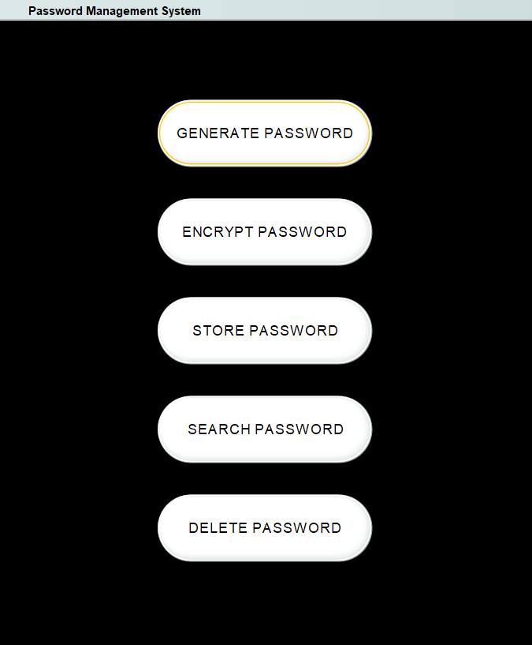

# 🔐 Password Management System for Students (PMSS)

A desktop password manager built in Java Swing — designed to give students a simple, secure way to generate, encrypt, store, and retrieve account passwords locally.



## Why

Students juggle logins for a dozen college portals, labs, and personal accounts, and tend to reuse weak passwords out of convenience. PMSS removes the excuse: generate a strong password, encrypt it, and pull it back up whenever you need it — no cloud account, no third-party service, everything stays on your own machine.

**Core capabilities:**
- 🔑 Generate cryptographically random passwords
- 🔒 Encrypt passwords with a salted hash before storing them — nothing is ever saved in plain text
- 🗂️ Store, search, and delete account credentials through a simple Swing GUI
- 🎨 Custom JTattoo look and feel, with an animated splash screen on launch

## How to Run

**Option 1 — run the prebuilt jar** (fastest, no compiling needed)

```bash
java -cp "PMSS.jar;lib/JTattoo-1.6.13.jar" PasswordManager     # Windows
java -cp "PMSS.jar:lib/JTattoo-1.6.13.jar" PasswordManager     # macOS/Linux
```

**Option 2 — compile from source**

```bash
cd src
javac -cp ../lib/JTattoo-1.6.13.jar *.java
java -cp ".;../lib/JTattoo-1.6.13.jar" PasswordManager     # Windows
java -cp ".:../lib/JTattoo-1.6.13.jar" PasswordManager     # macOS/Linux
```

> Requires a Java 17+ JDK on your `PATH`.

## Presented At

**ICCES 2022 International Conference** — presented as a solution addressing digital security awareness among students, with potential as a mobile or system-based utility app.

## Author

**Arjun K**
- GitHub: [@Arjunkalliyadath](https://github.com/Arjunkalliyadath)
- Email: arjunkalliyadath2001@gmail.com
